<!--horizontal divider-->  <!--Name--> 
 <ul align="center"> 
<h1 style="display: inline-block">Hi, I'm Yassine 👋</h1>
 </ul> 
 <!--Tagline--> 
 <ul align="center"> 
<h2 style="display: inline-block">Embedded engineer by instinct, cloud architect by design</h2>
 </ul> 

---

<!--Intro-->

- Currently interning at **Smartovate** with a focus on **Cloud & DevOps**
    
- Building **VanneControl** - an IoT valve control system for agricultural irrigation using Kotlin/Ktor, ESP32, MQTT, and Docker.
    
- Co-building **Crucible** - a deterministic simulation testing framework for Raft KV stores in Rust
    
- Software Engineering student at **ISIMM**, specializing in Software Engineering (Cycle Ingénieur, class of 2028)
    
- Ask me about **embedded systems, backend architecture, Ktor, Cloud/DevOps, or IoT protocols**
    
- Reach me at **kaibi.0yassine@gmail.com**
    

---

  
  &nbsp;
  

---

<!--Tech Stack--> 
 <ul align="center"> 
<h2 style="display: inline-block">Tech Stack</h2>
 </ul> 
 
  

---

<!--Connect--> 
 <ul align="center"> 
<h2 style="display: inline-block">Connect With Me</h2>
 </ul> 
 
 

 <!--horizontal divider--> 
